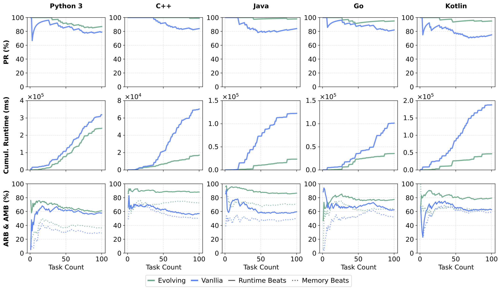

# Empirical Studies

This document summarizes empirical results for deploying **Autogenesis-Agent** under the **Autogenesis** protocol across a set of challenging benchmarks, demonstrating end-to-end self-evolution over heterogeneous agent resources.

## Benchmark instruction

### GPQA-Diamond (198 questions)

We adopt a **closed-book, non-retrieval** evaluation protocol. The agent is presented with a graduate-level STEM multiple-choice question (biology, chemistry, physics) and must output **exactly one option** as the final answer.

GPQA-Diamond is designed to be *Google-proof*: simple web search is insufficient, and success typically requires difficult, multi-step scientific reasoning beyond factual recall. This benchmark measures deep scientific understanding and closed-book reasoning ability.

### AIME24 / AIME25 (30 problems each)

We use problems from the 2024 and 2025 American Invitational Mathematics Examination (**AIME24** and **AIME25**). Each instance requires solving a competition-level problem and outputting a **single integer answer**.

We evaluate by **exact-match accuracy**, which primarily measures long-horizon symbolic reasoning and arithmetic precision.

### GAIA Test (300 tasks)

We evaluate on the **GAIA Test** split (300 tasks). Each task specifies a real-world, multi-step objective that typically requires planning and tool use (e.g., web browsing and document/file operations).

We measure performance by **task success (completion)**, reflecting long-horizon planning and reliable tool-use execution.

### LeetCode (in-house multi-language benchmark)

We construct an in-house, LeetCode multi-language programming benchmark to evaluate executable code generation under reduced data contamination. To mitigate training-data contamination from widely circulated legacy problems, we intentionally select recently released problems across diverse categories (arrays, trees, linked lists, etc.) and split them into **200 training** and **100 test** problems.

The agent solves each problem in one of multiple languages (Python, C++, Java, Go, etc.), and we report multiple metrics including overall score (acceptance), test-case pass rate, runtime, and memory, which together measure algorithmic reasoning, implementation correctness, and efficiency.

---

## Experiments on scientific and mathematical benchmarks

### Experiment setting

To validate Autogenesis-Agent under the Autogenesis protocol, we conduct experiments across **GPQA-Diamond**, **AIME24**, and **AIME25**, focusing on evolving **prompts** and **agent outputs**.

These benchmarks represent standard reasoning tasks where evolution of agent architecture, memory systems, environments, and tools is relatively less critical compared to instruction refinement and solution quality. To isolate self-evolution on prompts and solutions, we deliberately **do not equip Autogenesis-Agent with any external tools** in this setting, and compare three evolution strategies:

- evolve prompt only
- evolve solution only
- evolve prompt + solution

We evaluate using multiple backbone models:

- lower-performing: `gpt-4o`, `gpt-4.1`
- medium-performing: `claude-sonnet-4.5`
- high-performing: `gemini-3-flash-preview`, `grok-4.1-fast`

Our self-evolution algorithm primarily employs the **reflection optimizer** with a maximum of **3 optimization rounds**, after which the agent output is taken as the final solution.

### Metrics

We measure performance by **exact-match accuracy**:

- **GPQA-Diamond**: the selected option must match the ground-truth multiple-choice answer.
- **AIME24 / AIME25**: the numerical output must exactly match the reference integer answer.

### Results

**Table 1. Results on GPQA-Diamond, AIME24, and AIME25.**

| Approach | GPQA-Diamond | AIME24 | AIME25 |
|---|---:|---:|---:|
| *gpt-4o* |  |  |  |
| vanilla | 47.98 | 13.34 | 6.67 |
| evolve prompt | 53.81 | 13.34 | 13.34 |
| evolve solution | 53.53 | 16.67 | 13.34 |
| evolve prompt + solution | 58.08 | 16.67 | 13.34 |
| **Improvement (%)** | **21.05↑** | **24.97↑** | **100↑** |
| *gpt-4.1* |  |  |  |
| vanilla | 65.15 | 23.34 | 20.00 |
| evolve prompt | 68.68 | 33.33 | 23.33 |
| evolve solution | 68.68 | 36.67 | 30.00 |
| evolve prompt + solution | 67.67 | 40.00 | 33.33 |
| **Improvement (%)** | **3.87↑** | **71.38↑** | **66.65↑** |
| *grok-4.1-fast* |  |  |  |
| vanilla | 83.33 | 96.67 | 90.00 |
| evolve prompt | 83.84 | 96.67 | 93.33 |
| evolve solution | 87.81 | 96.67 | 90.00 |
| evolve prompt + solution | 89.34 | 96.67 | 96.67 |
| **Improvement (%)** | **7.21↑** | 0.00 | **7.41↑** |
| *claude-sonnet-4.5* |  |  |  |
| vanilla | 78.28 | 76.67 | 73.33 |
| evolve prompt | 79.79 | 86.67 | 90.00 |
| evolve solution | 80.30 | 80.00 | 90.00 |
| evolve prompt + solution | 81.44 | 86.67 | 90.00 |
| **Improvement (%)** | **4.04↑** | **13.04↑** | **22.73↑** |
| *gemini-3-flash-preview* |  |  |  |
| vanilla | 88.38 | 83.33 | 83.33 |
| evolve prompt | 88.89 | 93.33 | 86.67 |
| evolve solution | 87.88 | 93.33 | 90.00 |
| evolve prompt + solution | 90.40 | 93.33 | 93.33 |
| **Improvement (%)** | **2.28↑** | **12.00↑** | **12.00↑** |

### Analysis (key observations)

1. **Weak models gain more; strong models gain less.** Self-evolution corrects errors exposed during reflection. Weaker models make more correctable mistakes; stronger models operate closer to ceiling.
2. **Combined evolution dominates prompt-only and solution-only.** Evolving both instruction and solution addresses complementary failure modes.
3. **Math benchmarks respond more strongly than science QA.** Long-horizon symbolic reasoning exposes more intermediate failure points that reflection can target; closed-book science QA relies more on factual recall with fewer optimization levers.
4. **Ceiling effects cap evolution on saturated benchmarks.** When baseline is near-saturated, improvements diminish.

---

## Experiments on general agent benchmark (GAIA)

### Experiment setting

For GAIA, we focus on evolving **tools**, as GAIA tasks primarily depend on tool capabilities rather than pure reasoning.

Our system architecture consists of a top-level planner agent (\(m = 50\)) and multiple specialized sub-agents: a deep researcher (\(m = 3\)), a browser-use agent (\(m = 3\)), a report agent, a tool generator (\(m = 3\)), and a deep analyzer agent (\(m = 3\)). All agents use `gemini-3-flash-preview` as the backbone model, where \(m\) denotes the maximum number of reasoning steps per agent.

Tool self-evolution is driven by the tool generator agent:

- retrieve candidate tools from the managed tool registry via semantic search
- if a suitable tool exists, execute; on errors, iteratively refine the tool source through reflection
- if no suitable tool exists, synthesize a new tool and register it as a versioned RSPL resource for reuse

### Metrics

We adopt **Pass@1** on GAIA Test and report task-completion accuracy at each difficulty tier (Level 1/2/3) and overall average.

### Results

**Table 2. Performance on GAIA Test benchmark.**

| Agent | Level1 | Level2 | Level3 | Average |
|---|---:|---:|---:|---:|
| o4-mini-DR | 67.59 | 59.10 | 44.28 | 59.30 |
| JoyAgent | 77.42 | 67.30 | 46.94 | 67.11 |
| o3-DR | 79.42 | 68.97 | 47.48 | 68.70 |
| Langfun | 84.95 | 73.58 | 48.98 | 73.09 |
| Alita | 92.47 | 71.70 | 55.10 | 75.42 |
| DeSearch | 91.40 | 75.47 | 61.22 | 78.07 |
| h2oGPTe-Agent | 89.25 | 79.87 | 61.22 | 79.73 |
| Su-Zero-Ultra | 93.55 | 77.36 | 65.31 | 80.40 |
| AWorld | 95.70 | 81.13 | 57.14 | 81.73 |
| HALO | 94.62 | 84.91 | 69.39 | 85.38 |
| ToolOrchestra | 95.70 | 82.39 | 87.76 | 87.38 |
| **vanilla** | 91.40 | 77.36 | 61.22 | 79.07 |
| **evolve tool** | 98.92 | 85.53 | 81.63 | 89.04 |
| **Improvement (%)** | **8.23↑** | **10.56↑** | **33.34↑** | **12.61↑** |

### Analysis (key observations)

1. **State-of-the-art performance**: with 89.04% average, evolve tool surpasses public leaderboard entries; gains are largest on Level 3.
2. **Tool evolution helps hardest tasks most**: Level 3 sees the largest relative improvement (33.34%).
3. **Hierarchical resource management mitigates planning complexity**: treating prompts/tools/environments as RSPL resources with explicit lifecycle helps preserve session-critical state across agent boundaries and enables compositional generalization.

---

## Experiments on algorithmic coding benchmark (LeetCode)

### Benchmark design rationale (high-level)

We evaluate inference-time self-evolution on **executable code**, calibrate performance against human submission distributions, and assess cross-language robustness.

### Evaluation protocol (summary)

We compare a vanilla baseline against Autogenesis-Agent with **evolve solution** enabled. The evolving agent iteratively refines solutions through the SEPL reflection optimizer within a fixed budget of **3 rounds**.

### Metrics

We report three groups of metrics:

- **Capability**: PR (accepted count), TLE, MLE, CE, RE, WA, TO, RpE
- **Efficiency**: AR (runtime), AM (memory), APC (avg passed cases before failure)
- **Human-referenced**: ARB (runtime beats), AMB (memory beats)

**Table 3. Evaluation metrics for the algorithmic coding benchmark.**

| Metric | Description |
|---|---|
| **PR** | Number of problems passing all test cases within time and memory limits. |
| **TLE** | Number of problems exceeding the allowed execution time limit. |
| **MLE** | Number of problems exceeding the allowed memory usage. |
| **CE** | Number of problems where generated code failed to compile. |
| **RE** | Number of problems encountering a runtime error during execution. |
| **WA** | Number of problems producing incorrect output. |
| **TO** | Number of problems where the model failed to respond within the timeout. |
| **RpE** | Number of problems where the model returned an invalid or unparseable response. |
| **AR (ms)** | Mean runtime (ms) of accepted solutions. |
| **AM (MB)** | Mean memory (MB) of accepted solutions. |
| **APC** | Mean test cases passed before failure. |
| **ARB (%)** | Percentage of accepted solutions whose runtime outperforms human submissions. |
| **AMB (%)** | Percentage of accepted solutions whose memory usage outperforms human submissions. |

### Results (gemini-3-flash-preview)

The table below is transcribed from the LaTeX table you provided (vanilla vs evolve solution).

| Language / Approach | PR | TLE | MLE | CE | RE | WA | TO | RpE | AR (ms) | AM (MB) | APC | ARB (%) | AMB (%) |
|---|---:|---:|---:|---:|---:|---:|---:|---:|---:|---:|---:|---:|---:|
| **Python3 — vanilla** | 79 | 4 | 0 | 0 | 2 | 14 | 1 | 0 | 1376.19 | 56.59 | 750.89 | 73.28 | 36.62 |
| **Python3 — evolve solution** | 87 | 3 | 0 | 0 | 1 | 9 | 0 | 0 | 1269.39 | 59.08 | 750.98 | 70.29 | 42.15 |
| **Python3 — Improvement (%)** | **10.1↑** | **25.0↑** | 0.0 | 0.0 | **50.0↑** | **35.7↑** | **100.0↑** | 0.0 | **7.8↑** | 4.4↓ | 0.0↓ | 4.1↓ | **15.1↑** |
| **C++ — vanilla** | 84 | 2 | 0 | 2 | 1 | 10 | 0 | 1 | 266.04 | 168.93 | 743.31 | 68.02 | 59.24 |
| **C++ — evolve solution** | 99 | 0 | 0 | 0 | 0 | 1 | 0 | 0 | 142.60 | 148.43 | 749.86 | 88.99 | 73.14 |
| **C++ — Improvement (%)** | **17.9↑** | **100.0↑** | 0.0 | **100.0↑** | **100.0↑** | **90.0↑** | 0.0 | **100.0↑** | **46.4↑** | **12.1↑** | 0.9↓ | **30.8↑** | **23.5↑** |
| **Java — vanilla** | 84 | 0 | 0 | 2 | 2 | 9 | 1 | 2 | 125.04 | 126.09 | 752.86 | 71.03 | 59.18 |
| **Java — evolve solution** | 98 | 1 | 0 | 0 | 0 | 1 | 0 | 0 | 96.30 | 120.00 | 751.09 | 88.33 | 72.38 |
| **Java — Improvement (%)** | **16.7↑** | 0.0 | 0.0 | **100.0↑** | **100.0↑** | **88.9↑** | **100.0↑** | **100.0↑** | **23.0↑** | **4.8↑** | **0.2↑** | **24.4↑** | **22.3↑** |
| **Go — vanilla** | 82 | 1 | 0 | 9 | 0 | 7 | 0 | 1 | 139.22 | 22.01 | 739.46 | 76.22 | 63.48 |
| **Go — evolve solution** | 95 | 0 | 0 | 0 | 0 | 5 | 0 | 0 | 111.64 | 18.35 | 754.17 | 81.52 | 67.94 |
| **Go — Improvement (%)** | **15.9↑** | **100.0↑** | 0.0 | **100.0↑** | 0.0 | **28.6↑** | 0.0 | **100.0↑** | **19.8↑** | **16.6↑** | 2.0↓ | **7.0↑** | **7.0↑** |
| **Kotlin — vanilla** | 75 | 2 | 0 | 8 | 1 | 10 | 2 | 2 | 171.99 | 72.80 | 760.43 | 83.49 | 79.07 |
| **Kotlin — evolve solution** | 95 | 1 | 0 | 0 | 0 | 4 | 0 | 0 | 122.83 | 77.88 | 749.38 | 83.58 | 67.21 |
| **Kotlin — Improvement (%)** | **26.7↑** | **50.0↑** | 0.0 | **100.0↑** | **100.0↑** | **60.0↑** | **100.0↑** | **100.0↑** | **28.6↑** | 7.0↓ | 1.5↓ | **0.1↑** | 15.0↓ |

### Within-inference trajectories

The figure below compares **evolving** vs **vanilla** agents across the 100-task test split for each language:

- **PR (%)** trajectory (top row)
- **Cumulative runtime (ms)** over tasks (middle row)
- **ARB/AMB (%)** trajectories (bottom row): runtime/memory beats against human submissions

